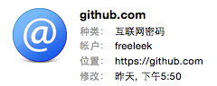

#	一个非自愿傻瓜与 Mac 的故事

圣人曰：“[朝闻道，夕死可矣。](http://baike.baidu.com/view/609778.htm)”[^1]我没有圣人的觉悟，却也不愿意做一个蒙在鼓里的傻瓜。

[^1]: 出自《[论语](http://yuedu.baidu.com/ebook/4ac76f8365ce0508763213f7)·里仁》。

##	Thursday Feb 4, 2016
###	git client vs. KeyChain   
PUSH 代码库到 github 的时候，除了第一次提示我输入用户名和密码，之后就不再提示我输入密码，连用户名都没有提示，但却自动使用了我的账号，这是怎么回事？强调一下，我没有使用 SSH key。

```bash
$ git push origin HEAD
# 未提示输入用户名或密码，即以我的账号自动完成。

$ git config --list
# 没有 user.name 和 auth token 信息。

$ git config --global --list
# 没有 user.name 和 auth token 信息。
```

实际上，我是脑袋短路了，误将 git 当 npm，才会去配置信息中查找线索。与 npm 不同，git 配置中记录的用户名（user.name）和邮箱地址（user.email），与远端（remote）访问账号没有任何关系，而是和 npm > package.json > author 的意义相仿。并且，不论是 git 本地配置文件（ <REPOSITORY>/.git/config），还是全局配置文件（~/.gitconfig），都不会记录远端访问账号的令牌。

原来账号信息被保存在“Keychain Access.app / 钥匙串访问”中：  


揣测与我使用的 git 客户端版本有关：

```bash
$ git --version
git version 2.3.8 (Apple Git-58)
# 这是 Apple 定制版的 git 客户端。
```

那么，如果我有两个 github 账号，怎么办呢？办法之一是将账号固定在 remote url 中，例如：  

```bash
$ git remote -v
origin	https://freeleek@github.com/freeleek/leekongfu.git (fetch)
origin	https://freeleek@github.com/freeleek/leekongfu.git (push)
```

使用 Apple 定制版 git 客户端访问远端的时候，KeyChain 会自动记录账号和密码，后续访问时，客户端也会自动从 KeyChain 中提取匹配的账号，不会再次提示输入密码。的确很方便，再也不需要 SSH key 了。

Mac 君：省森麻？我都帮你搞惦了！  
傻瓜：你下次动手之前，能不能先跟我打个招呼吗？
